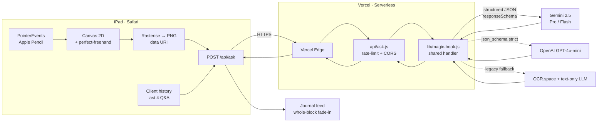

# inkQL

> **A query language written in ink.** Handwrite a question on iPad, get a structured, context-aware answer from a vision LLM.

<p align="left">
  <a href="https://inkql.vercel.app/"></a>
  
  
  
</p>

**Live app →** https://inkql.vercel.app/

inkQL turns freehand ink into a first-class API surface. You write on a low-latency canvas with an Apple Pencil, the strokes are rasterised into an image, a multimodal LLM (Gemini 2.5 or GPT-4o) transcribes and answers, and the response streams into a journal-style feed. Follow-up questions inherit the last several exchanges so the model can answer contextual queries ("tell me more", "why?", "who was that?").

The stack has **no build step**, **no bundler**, and **no client-side framework** — vanilla ES modules imported from a CDN, static assets served by Vercel, and one serverless function for the vision call. Everything is optimised for iPad Safari + Apple Pencil.

---

## Architecture



**One binary contract** (`handleAsk`) is shared between the local Express dev server and the Vercel serverless runtime, so prompts, validation, and error mapping never drift.

### Request lifecycle

1. **Ink capture** — `pointerdown → pointermove → pointerup` with `setPointerCapture` and `getCoalescedEvents` for high-frequency Pencil samples. Strokes are stored as pressure-aware point lists.
2. **Rasterise** — the offscreen canvas is re-drawn from the stroke array (independent of the visible surface) and exported as `image/png` base64, capped at 3 MB.
3. **Ask** — `POST /api/ask { image, history[] }`. In-memory sliding-window rate limit (15/min, 100/day/IP).
4. **Vision call** — provider selected by `AI_PROVIDER`. Gemini uses `generationConfig.responseSchema` for guaranteed-shape JSON; OpenAI uses `response_format: json_schema` with `strict: true`.
5. **Render** — the returned `{ transcribed, confidence, answer }` becomes a new journal entry. The answer element opacity-transitions from 0 → 1 in one block (no per-character reveal, per the minimal design).

---

## Tech stack

| Layer          | Choice                                                             | Why                                                                 |
| -------------- | ------------------------------------------------------------------ | ------------------------------------------------------------------- |
| Runtime        | Node.js ≥ 18, ES modules                                           | native `fetch`, no polyfills, matches Vercel serverless target      |
| Local server   | **Express 4** + `express-rate-limit`                               | mirrors the Vercel handler contract, no build-time abstractions     |
| Serverless     | Vercel Functions (Node.js)                                         | zero-config, region-close cold starts, GitHub push-to-deploy        |
| Frontend       | Vanilla HTML/CSS/ES modules (no framework, no bundler)             | fastest possible first paint; every KB is intentional               |
| Stroke engine  | [`perfect-freehand`](https://github.com/steveruizok/perfect-freehand) via `esm.sh` | pressure-aware variable-width lines, no npm install needed on client |
| Canvas         | HTML5 Canvas 2D with `desynchronized: true` + DPR scaling          | low-latency pen input on iPadOS                                     |
| Vision LLM     | **Google Gemini 2.5** (default) with **OpenAI GPT-4o-mini** alt    | dual-provider so cost/quality can be swapped by env var             |
| Fonts          | Inter, JetBrains Mono (Google Fonts, `display=swap`)               | product-grade UI type, no FOUT jank                                 |
| Hosting        | Vercel (static assets + serverless functions)                      | edge distribution, automatic HTTPS, preview deployments             |
| CI/CD          | Git push → Vercel auto-build                                       | no separate pipeline to maintain                                    |

---

## Engineering highlights

Things worth reading the diff for:

### 1. Apple Pencil "stroke uploads but doesn't render" bug on iPadOS

The first prod bug: strokes were being sent to the API but not rendering on the visible canvas. Two root causes fixed together:

- **`e.buttons === 0` mid-stroke.** On iPadOS 17+, Safari periodically reports `buttons: 0` during a continuous Apple Pencil contact. The original `pointermove` handler gated on `buttons !== 0` and dropped those events, so only the initial anchor point survived. Fix: track an `activePointerId` set in `pointerdown` and end only on `pointerup` / `pointercancel` for that id.
- **Canvas sized before layout.** `getBoundingClientRect()` returned `0×0` on cold load because it ran before Flexbox resolved. The backing store was then `0×0` and every draw fell outside the visible area. Fix: `ResizeObserver` on the canvas element + a double `requestAnimationFrame` bootstrap, so the DPR-scaled backing store tracks the real layout.

Full explanation lives at [`public/app.js`](public/app.js) around `pointerdown` and `resize`.

### 2. Structured LLM output — no post-hoc parsing

Both providers are configured to return JSON matching a schema, so the client never has to parse free-form text:

```js
// lib/magic-book.js (Gemini)
generationConfig: {
  responseMimeType: 'application/json',
  responseSchema: {
    type: 'OBJECT',
    properties: {
      transcribed: { type: 'STRING' },
      confidence:  { type: 'STRING', enum: ['high', 'medium', 'low'] },
      answer:      { type: 'STRING' },
    },
    required: ['transcribed', 'confidence', 'answer'],
  },
  temperature: 0.4,
  maxOutputTokens: 600,
}
```

OpenAI is the mirror shape (`response_format: { type: 'json_schema', json_schema: { strict: true, ... } }`). Swapping providers is a single env-var flip.

### 3. Client-managed conversation memory

Rather than a stateful backend, the client holds the last 4 Q&A pairs and ships them with every request. The server sanitises the payload (`normalizeHistory` caps entries + field length) and injects a *Previous chapters* block into the prompt so follow-ups have context without inflating the token budget or introducing session storage.

### 4. One handler, two entry points

`lib/magic-book.js` exports `handleAsk(image, history)` — a single async function called by both `server.js` (Express, for local dev + LAN iPad testing) and `api/ask.js` (Vercel). Prompts, schemas, provider selection, timeout handling, and the error-to-message mapping all live in one place.

### 5. Security surface

- Per-IP rate limit — 15/min, 100/day. In-memory sliding window on Vercel (best-effort per instance); `express-rate-limit` locally.
- CORS is deny-by-default; `ALLOWED_ORIGIN` env var opts a single origin in.
- Standard security headers on every response: `X-Content-Type-Options`, `X-Frame-Options`, `Referrer-Policy`, `Permissions-Policy`.
- Client errors are mapped through `toClientError()` to short user-facing messages — no upstream stack traces leak.
- Base64 payload is validated (`data:image/*` prefix, size cap, charset) before any provider call.

---

## API

### `POST /api/ask`

**Request**

```jsonc
{
  "image": "data:image/png;base64,iVBORw0KGgo…",   // required, ≤ 3 MB
  "history": [                                     // optional, last 4 pairs
    { "question": "who invented calculus?",
      "answer":   "Independently, Newton and Leibniz in the late 17th century." }
  ]
}
```

**Response — 200**

```json
{
  "transcribed": "tell me more",
  "confidence":  "high",
  "answer":      "Building on the last thought, Leibniz's notation…",
  "provider":    "gemini"
}
```

**Error responses**

| Status | `error`         | When                                                    |
| ------ | --------------- | ------------------------------------------------------- |
| 400    | `bad_image`     | missing / malformed / oversized image                   |
| 429    | `rate_limit`    | > 15 requests in the last 60s from this IP              |
| 429    | `daily_limit`   | > 100 requests in the last 24h from this IP             |
| 429    | `quota`         | upstream provider quota exhausted                       |
| 500    | `server_error`  | any other upstream failure (message is safe to display) |
| 502    | `auth`          | provider API key rejected                               |
| 504    | `timeout`       | 25 s upstream timeout                                   |

---

## Local development

```bash
# 1. Get a Gemini key: https://aistudio.google.com/apikey
cp .env.example .env
# edit .env → set GEMINI_API_KEY

# 2. Install and run
npm install
npm run dev            # nodemon-style: node --watch server.js
```

Open http://localhost:3000 on the laptop.

### Test on iPad (same Wi-Fi)

```bash
ipconfig               # note the IPv4 address, e.g. 192.168.0.10
```

On iPad Safari, open `http://192.168.0.10:3000`. Allow Node.js through Windows Firewall when prompted.

### Environment variables

| Variable          | Default              | Notes                                                        |
| ----------------- | -------------------- | ------------------------------------------------------------ |
| `GEMINI_API_KEY`  | —                    | required unless `AI_PROVIDER=openai`                         |
| `OPENAI_API_KEY`  | —                    | required when `AI_PROVIDER=openai`                           |
| `AI_PROVIDER`     | `gemini`             | `gemini` \| `openai`                                          |
| `GEMINI_MODEL`    | `gemini-2.5-pro`     | any Gemini vision-capable model                              |
| `OPENAI_MODEL`    | `gpt-4o-mini`        | any GPT-4o family model                                      |
| `OCR_PROVIDER`    | `gemini`             | set to `ocrspace` to use OCR + text-only fallback            |
| `ALLOWED_ORIGIN`  | —                    | if set, CORS opens for exactly one origin                    |
| `TRUST_PROXY`     | —                    | set to `1` behind Vercel / Cloudflare so rate limits see IPs |
| `PORT`            | `3000`               | local dev port                                               |

---

## Deploy

Vercel is the target. `vercel.json` routes `/api/*` to the serverless function, everything else to the static bundle in `public/`.

```bash
git push origin main   # push-to-deploy is enabled on the linked Vercel project
```

Or use the CLI:

```bash
npm i -g vercel
vercel --prod
```

Set env vars once, in Vercel → Project Settings → Environment Variables.

---

## Project layout

```
inkql/
├── api/
│   └── ask.js               Vercel serverless entry (thin wrapper + rate limit)
├── lib/
│   └── magic-book.js        Shared: validation, provider dispatch, prompt, schemas
├── public/
│   ├── index.html           Journal shell (topbar / feed / composer)
│   ├── app.js               Canvas, pointer handling, feed rendering, history
│   └── style.css            Notion/Linear-inspired minimal design system
├── server.js                Local dev (Express + express-rate-limit)
├── vercel.json              Static + serverless routing
├── package.json             Dependencies + scripts
└── .env.example             Env-var template
```

---

## Roadmap

- [x] Vision LLM integration (Gemini) with structured output
- [x] Alternate provider (OpenAI GPT-4o)
- [x] Apple Pencil low-latency drawing
- [x] Client-side conversation history for follow-ups
- [x] iPad Safari pointer-event and layout-timing fixes
- [x] Minimal journal UI (Notion / Linear aesthetic)
- [ ] Streamed responses (SSE) for perceived latency
- [ ] Redis-backed rate limit (Upstash / Vercel KV)
- [ ] PWA install prompt + offline shell
- [ ] Palm rejection + Pencil hover preview
- [ ] Local IndexedDB history + export

---

## License

MIT. Ink is free.
